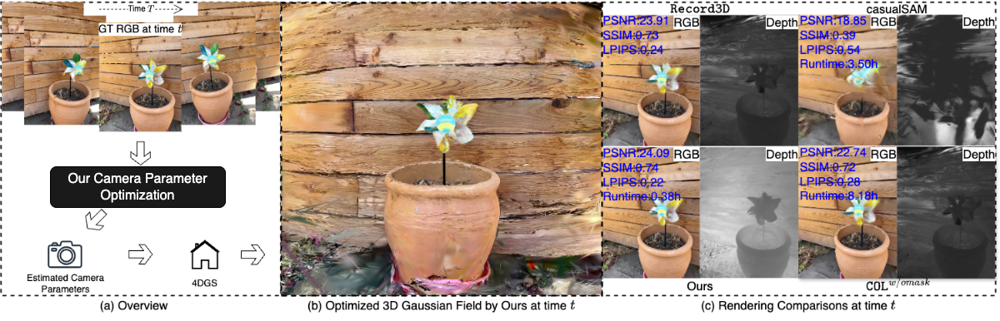

# 📷ROS-Cam

<hr>


Official implementation of **RGB-Only Supervised Camera Parameter Optimization in Dynamic Scenes**, NeurIPS 2025 (Spotlight)


[**Fang Li**](https://fangli333.github.io/),
[**Hao Zhang**](https://haoz19.github.io/),
[**Narendra Ahuja**](https://scholar.google.com/citations?user=dY7OSl0AAAAJ&hl=en),

<p align="center">
  
  <br>
</p>


<div style="line-height: 1;">
  <a href="https://arxiv.org/abs/2509.15123" target="_blank" style="margin: 2px;">
    
  </a>
</div>


## NEWS
- 11/09/2025: Code is released.

## ENVIRONMENT SETUP
```bash
git clone --recursive https://github.com/fangli333/ROS-Cam.git
cd ROS-Cam
conda create -n ROS-Cam python=3.10
conda activate ROS-Cam
pip install torch==2.1.0+cu118 torchvision==0.16.0+cu118 torchaudio==2.1.0+cu118 --extra-index-url https://download.pytorch.org/whl/cu118
pip install -r requirements.txt
python -m pip install submodules/depth-diff-gaussian-rasterization --no-build-isolation
python -m pip install submodules/simple-knn --no-build-isolation
```
Please also customize the environment based on your devices.

## DATA
- [NeRD-DS](https://jokeryan.github.io/projects/nerf-ds/)
- [DAVIS](https://davischallenge.org/davis2016/code.html)
- [iPhone](https://kair-bair.github.io/dycheck/)
- [MPI-Sintel](http://sintel.is.tue.mpg.de/)
- [TUM-Dynamic](https://cvg.cit.tum.de/data/datasets/rgbd-dataset/download)

## OPTIMIZATION

Patch-wise Tracking Filters

```bash
python filters.py
```

Camera Parameter Optimization & 4D Scene Reconstruction
```bash
python train.py -s data_path --port 6017 --expname exp_path --configs arguments/default.py --ptidxfolder filters_result_path --pt3dplyfolder points3d.ply --camerafolder cameraresult_path

#For example:
python train.py -s data/DAVIS/JPEGImages/480p/bear --port 6017 --expname "davis/bear" --configs arguments/default.py --ptidxfolder filter_results/DAVIS/bear --pt3dplyfolder points3d.ply --camerafolder result
```

## CITATION
If you find our work useful, please cite:
```bash
@article{li2025rgb,
  title={RGB-Only Supervised Camera Parameter Optimization in Dynamic Scenes},
  author={Li, Fang and Zhang, Hao and Ahuja, Narendra},
  journal={arXiv preprint arXiv:2509.15123},
  year={2025}
}
```

##ACKNOWLEDGEMENTS
Our code is based on [CoTracker](https://github.com/facebookresearch/co-tracker) and (4DGS)[https://github.com/hustvl/4DGaussians]. we thank the authors for their excellent work!


